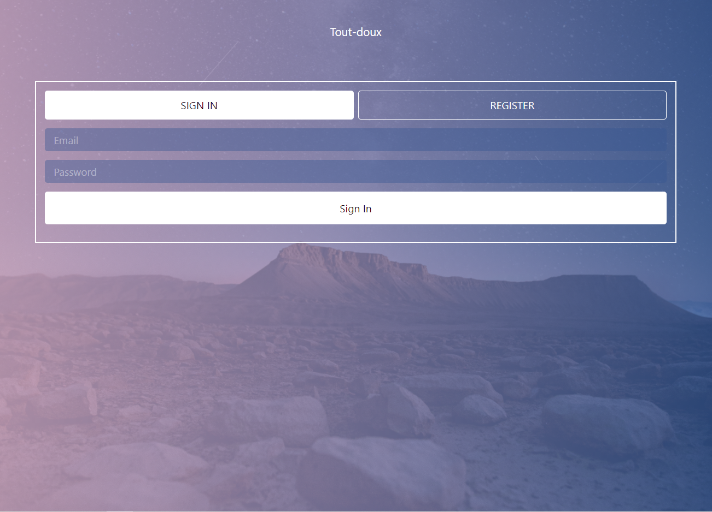
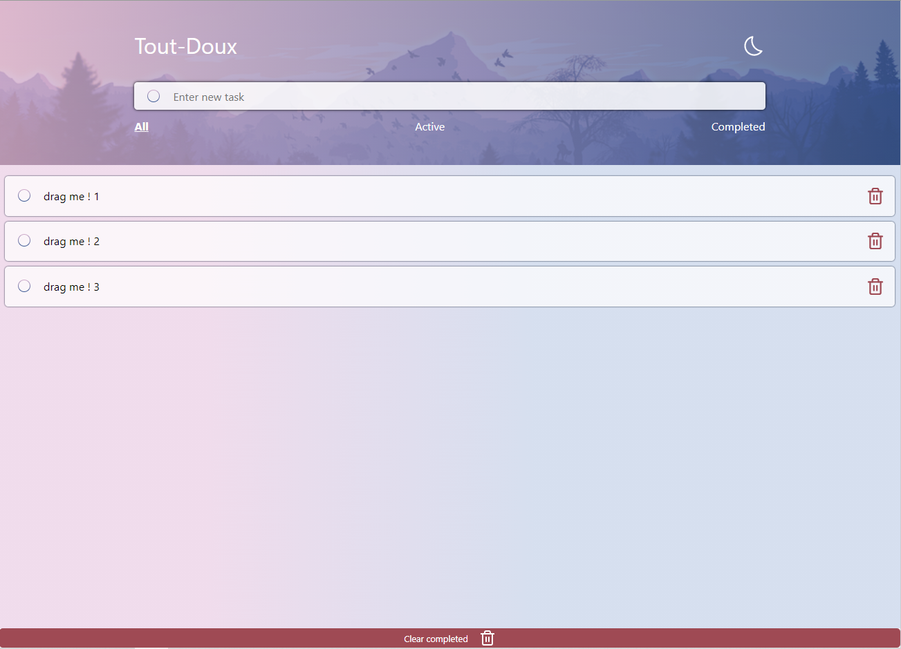
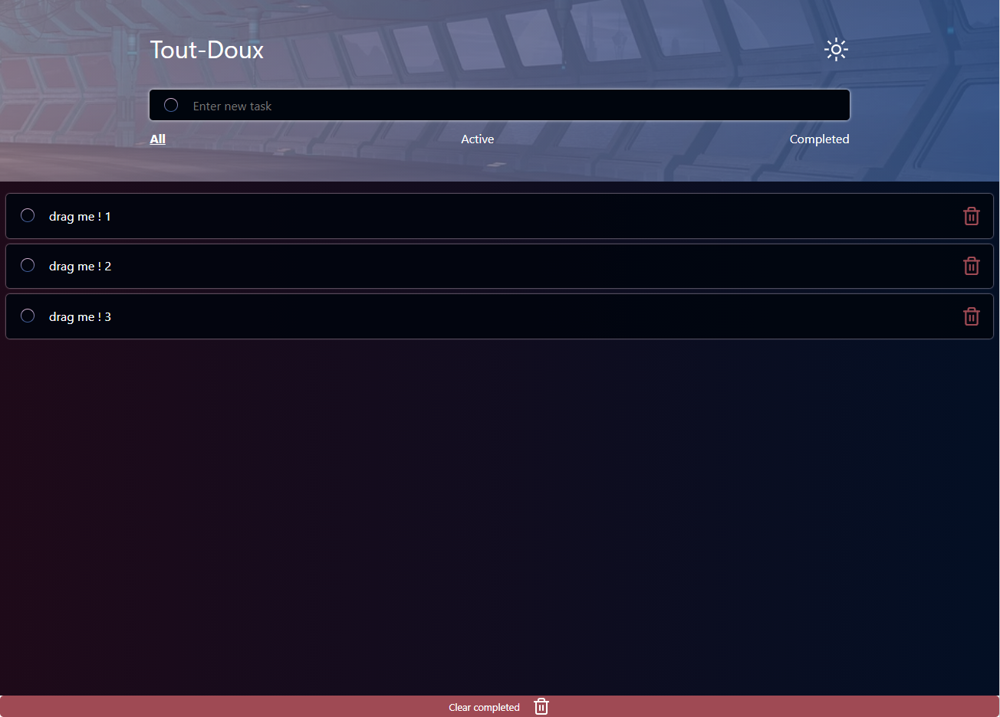

<h1 align="center">Tout-doux-List</h1>

Hi there 👋

Welcome on my Todo-list 🤗

👉 Through this project, I wanted to train on React / Redux combined with Firebase.

👌 There is a lot of interactions with a todo-list and with a Sign up / Register interface

 

I hope you'll enjoy !

<h2>Stack</h2>

  React , 
  Redux ,
  Sass 
  and Firebase

<h2>🚀 Demo</h2>

[https://tout-doux-list.surge.sh/](https://tout-doux-list.surge.sh/)

<h2>Project Screenshots:</h2>

